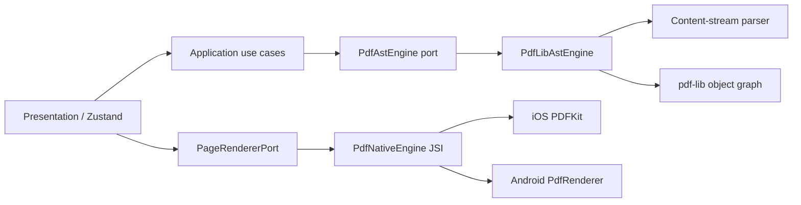
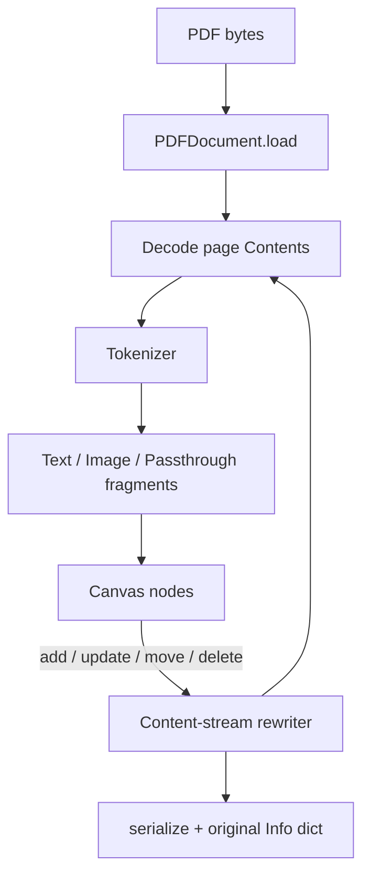

**Author:** Alghisi Alessandro Paolo  
**Contact:** alexalghisi@gmail.com

# PDF Editor

A professional React Native PDF editor that loads, parses, and **rewrites the PDF content stream**. Text and images are first-class nodes in the document AST. Mutations are not flattened annotations.

The project is built with TDD, Clean Architecture, and strict TypeScript. Page rasterization runs in a JSI/Expo native module (PDFKit on iOS, `PdfRenderer` on Android) so large documents never block the JS thread.

## Architecture

```
pdf-editor/
├── App.tsx
├── index.ts
├── modules/pdf-native-engine/          # JSI native rasterizer
│   ├── ios/PdfNativeEngineModule.swift # PDFKit
│   └── android/.../PdfNativeEngineModule.kt
└── src/
    ├── domain/                         # Enterprise rules — no I/O
    │   ├── entities/                   # PdfDocument, PdfPage, nodes
    │   ├── valueObjects/               # Rect, RgbColor, PdfObjectId, Matrix
    │   ├── services/PdfAstEngine.ts    # Port (hexagonal)
    │   └── errors/
    ├── application/                    # Use cases
    │   ├── ports/                      # FileSystem, PageRenderer
    │   └── useCases/                   # Load, Save, Mutate
    ├── infrastructure/                 # Adapters
    │   ├── pdf/                        # Content-stream parser + rewriter
    │   ├── native/                     # TurboModule spec + fallback
    │   ├── fs/                         # Expo file system
    │   └── di/container.ts
    └── presentation/                   # UI — no PDF object-graph knowledge
        ├── store/editorStore.ts        # Zustand
        ├── canvas/                     # Pinch-zoom, drag, inline edit
        ├── screens/
        └── theme/
```





### Why this split

| Layer | Responsibility |
| --- | --- |
| Domain | Immutable document model in ISO 32000 user space. No React, no pdf-lib. |
| Application | Orchestrates ports. Returns `Result<T, PdfDomainError>`. |
| Infrastructure | Parses operators (`Tj`, `TJ`, `Do`, `cm`, …), rewrites streams, embeds fonts/XObjects. |
| Native | Rasterizes a page off-thread. Never owns the AST. |
| Presentation | Converts PDF space ↔ screen space. Drag, pinch, inline text. |

UI components never import `pdf-lib`. The store talks only to use cases.

## Capabilities

- Load and parse existing PDFs (catalog, pages, Info dictionary).
- Extract **text** (`BT`/`Tj`/`TJ`) and **images** (`Do` XObjects) with page-space bounds.
- Add, update, delete, and move text and images by rewriting the page content stream.
- Preserve vector art as passthrough operator groups.
- Lossless save that restores title, author, creator, and producer.
- Interactive canvas: pinch-to-zoom, drag nodes, long-press to edit text.
- Native page preview when a dev client / release build includes `PdfNativeEngine`.

## Setup

```bash
cd pdf-editor
npm install
npm test
npm run typecheck
npx expo start
```

A development build is required for the native rasterizer:

```bash
npx expo prebuild
npx expo run:ios
# or
npx expo run:android
```

Expo Go still edits the AST. The canvas draws a paper surface and node overlays when the JSI module is absent.

### Scripts

| Command | Purpose |
| --- | --- |
| `npm test` | Jest + Testing Library (TDD suite) |
| `npm run test:coverage` | Coverage with thresholds |
| `npm run typecheck` | `tsc --noEmit`, strict + `noUncheckedIndexedAccess` |
| `npx expo start` | Metro bundler |

## TDD map

Tests were written before the engine implementation:

1. `src/infrastructure/pdf/contentStream/__tests__/tokenizer.test.ts`
2. `src/infrastructure/pdf/contentStream/__tests__/parser.test.ts`
3. `src/infrastructure/pdf/__tests__/PdfAstEngine.parse.test.ts`
4. `src/infrastructure/pdf/__tests__/PdfAstEngine.mutate.test.ts`

Fixtures are hand-rolled ISO 32000 files (`buildFixturePdf`), not objects that pdf-lib already understands.

## Native contract (JSI / TurboModule)

```ts
type NativePdfEngineSpec = {
  getPageCount(path: string): Promise<number>;
  getPageSize(path: string, pageIndex: number): Promise<{ width: number; height: number }>;
  renderPage(path: string, pageIndex: number, scale: number): Promise<{
    uri: string;
    width: number;
    height: number;
  }>;
};
```

Decoded bitmaps are written to a temp PNG and released. The JS thread only receives a URI.

## State

Zustand holds the open `PdfDocument`, selection, page index, and zoom. Mutations go through `MutateDocument`, which snapshots the engine session so the UI always reads a fresh immutable graph.

## License

Private. All rights reserved unless otherwise agreed with the author.
