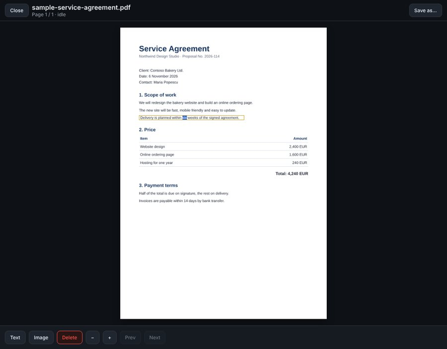
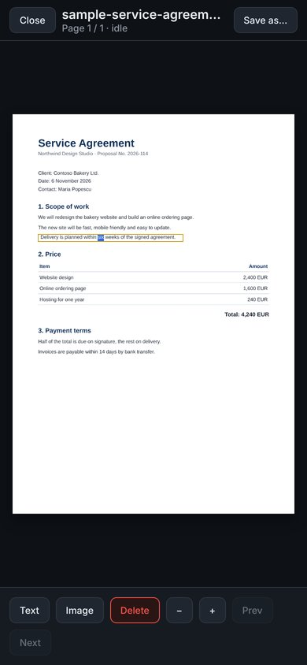
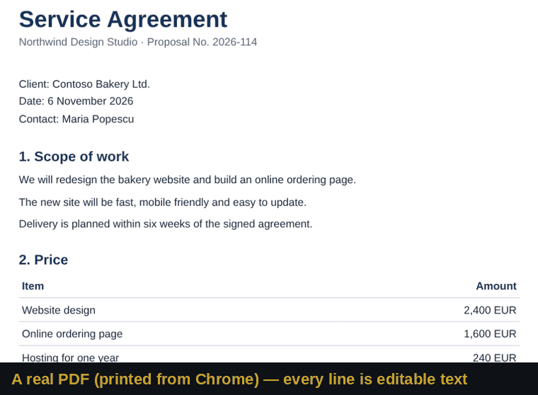
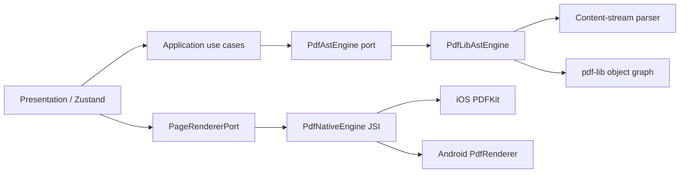
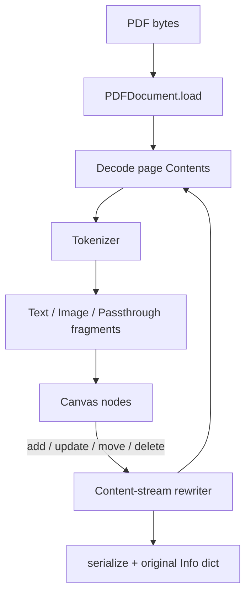
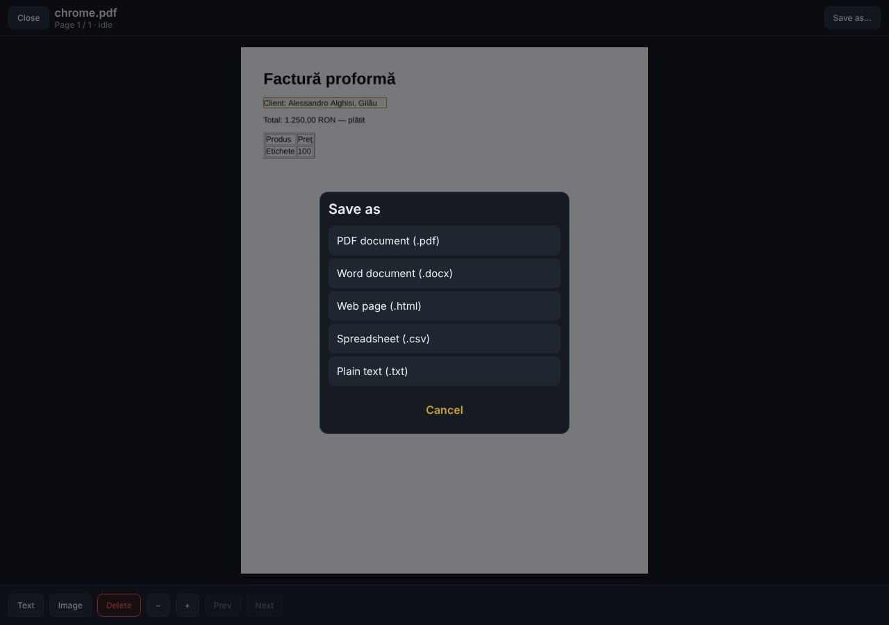

**Author:** Alghisi Alessandro Paolo  
**Contact:** alexalghisi@gmail.com

# PDF Editor

[](https://github.com/alexalghisi/pdf-editor/actions/workflows/ci.yml)
[](https://github.com/alexalghisi/pdf-editor/actions/workflows/pages.yml)

**▶ Open the app: https://alexalghisi.github.io/pdf-editor/** — runs in any modern browser on desktop, Android and iPhone. No install needed.

A professional React Native PDF editor that loads, parses, and **rewrites the PDF content stream**. Text and images are first-class nodes in the document AST. Mutations are not flattened annotations.

| Desktop browser                           | Phone browser                                                          |
| ----------------------------------------- | ---------------------------------------------------------------------- |
|  |  |

## Edit the text of any PDF like a document



The GIF is the live web app on a real PDF printed from Chrome ([sample-service-agreement.pdf](docs/sample-service-agreement.pdf) — open it in the app and try it):

1. **Click a line** to select it, **click it again** to edit. It opens with the whole line selected, so typing overwrites it.
2. Inside the line it behaves like a text field in a document: click or use the arrow keys to place the caret, **Shift+arrows / double-click / drag** to select a word, **Backspace/Delete**, **Ctrl/Cmd+A**, copy and paste.
3. **Enter** (or clicking elsewhere) writes the new text into the PDF; **Esc** cancels.
4. **Save as…** PDF, Word, HTML, CSV or text.

The page you see is the real PDF, re-rendered by pdf.js after each edit — the text is rewritten in the page content stream, not painted over with an annotation. On a phone it works the same way with taps and the on-screen keyboard.

The project is built with TDD, Clean Architecture, and strict TypeScript. Page rasterization runs in a JSI/Expo native module (PDFKit on iOS, `PdfRenderer` on Android) so large documents never block the JS thread.

## Architecture

```
pdf-editor/
├── App.tsx
├── index.ts
├── modules/pdf-native-engine/          # JSI native rasterizer
│   ├── ios/PdfNativeEngineModule.swift # PDFKit
│   └── android/.../PdfNativeEngineModule.kt
└── src/
    ├── domain/                         # Enterprise rules — no I/O
    │   ├── entities/                   # PdfDocument, PdfPage, nodes
    │   ├── valueObjects/               # Rect, RgbColor, PdfObjectId, Matrix
    │   ├── services/PdfAstEngine.ts    # Port (hexagonal)
    │   └── errors/
    ├── application/                    # Use cases
    │   ├── ports/                      # FileSystem, PageRenderer
    │   └── useCases/                   # Load, Save, Mutate
    ├── infrastructure/                 # Adapters
    │   ├── pdf/                        # Content-stream parser + rewriter
    │   ├── native/                     # TurboModule spec + fallback
    │   ├── fs/                         # Expo file system
    │   └── di/container.ts
    └── presentation/                   # UI — no PDF object-graph knowledge
        ├── store/editorStore.ts        # Zustand
        ├── canvas/                     # Pinch-zoom, drag, inline edit
        ├── screens/
        └── theme/
```


```mermaid
flowchart LR
  UI[Presentation / Zustand] --> UC[Application use cases]
  UC --> Port[PdfAstEngine port]
  Port --> Engine[PdfLibAstEngine]
  Engine --> Parser[Content-stream parser]
  Engine --> Lib[pdf-lib object graph]
  UI --> Render[PageRendererPort]
  Render --> Native[PdfNativeEngine JSI]
  Native --> PDFKit[iOS PDFKit]
  Native --> AndroidPdf[Android PdfRenderer]
```


```mermaid
flowchart TB
  Bytes[PDF bytes] --> Load[PDFDocument.load]
  Load --> Streams[Decode page Contents]
  Streams --> Tokens[Tokenizer]
  Tokens --> AST[Text / Image / Passthrough fragments]
  AST --> UINodes[Canvas nodes]
  UINodes -->|add / update / move / delete| Rewrite[Content-stream rewriter]
  Rewrite --> Streams
  Rewrite --> Save[serialize + original Info dict]
```

### Why this split

| Layer          | Responsibility                                                                         |
| -------------- | -------------------------------------------------------------------------------------- |
| Domain         | Immutable document model in ISO 32000 user space. No React, no pdf-lib.                |
| Application    | Orchestrates ports. Returns `Result<T, PdfDomainError>`.                               |
| Infrastructure | Parses operators (`Tj`, `TJ`, `Do`, `cm`, …), rewrites streams, embeds fonts/XObjects. |
| Native         | Rasterizes a page off-thread. Never owns the AST.                                      |
| Presentation   | Converts PDF space ↔ screen space. Drag, pinch, inline text.                           |

UI components never import `pdf-lib`. The store talks only to use cases.

## Capabilities

- Load and parse existing PDFs (catalog, pages, Info dictionary).
- Extract **text** (`BT`/`Tj`/`TJ`) and **images** (`Do` XObjects) with page-space bounds.
- Add, update, delete, and move text and images by rewriting the page content stream.
- Preserve vector art as passthrough operator groups.
- Untouched operators are written back as they were, so a page that is only partly edited keeps the rest of its content operator for operator — including pages drawn under a flipped or scaled CTM, as browsers and office suites produce them.
- Lossless save that restores title, author, creator, and producer.
- **Save as** PDF, Word (`.docx`), web page (`.html`, every line at its PDF position), spreadsheet (`.csv`, table cells become columns, UTF-8 with BOM for Excel) or plain text. On the web the file downloads; on iOS/Android it opens the share sheet.



- Interactive canvas: tap to select, drag to move, tap a selected text again to edit it in place (Enter saves, Esc cancels), pinch or `−`/`+` to zoom.
- Live page preview of the edited document: pdf.js on web, `PdfNativeEngine` in a dev client / release build.

### Known limitations

- Fonts are swapped, not synthesized: retyped text that the original subset font cannot show is drawn in Liberation Sans (metric-compatible with Arial/Helvetica).

- Existing text is read through each font's `ToUnicode` CMap, `Encoding` and `Differences`, so PDFs from Chrome, Word, LibreOffice and LaTeX show and edit as real text (including `Identity-H` two-byte fonts). An edit keeps the document's own font when that font has every glyph; otherwise the run switches to a bundled Unicode font (Liberation Sans, SIL OFL), so Romanian (ș ț ă î â), Greek, Cyrillic and symbols always render.
- Composite fonts that ship no `ToUnicode` map carry glyph ids only; their text can be moved or deleted, and retyping it writes the new text in the Unicode font.
- Text drawn inside form XObjects is rendered but not yet exposed as editable nodes.

## Setup

```bash
cd pdf-editor
npm install
npm test
npm run typecheck
npx expo start
```

A development build is required for the native rasterizer:

```bash
npx expo prebuild
npx expo run:ios
# or
npx expo run:android
```

Expo Go still edits the AST. The canvas draws a paper surface and node overlays when the JSI module is absent.

### Run in the browser (no Xcode required)

The engine is `pdf-lib`, so the whole editor runs unchanged on the web. A build is
published to GitHub Pages and works on any device — including an iPhone — straight
from the browser:

**Live app:** https://alexalghisi.github.io/pdf-editor/

```bash
npm run build:web   # exports a static bundle to ./dist
npx expo start --web
```

On web, document/image pickers hand back `blob:`/`data:` URIs, and a save is
delivered as a browser download of the edited PDF. Pages are rasterized by
pdf.js in a module worker (`public/pdf.worker.min.mjs`, copied from
`node_modules` on `npm install`). Every push to `main` rebuilds and redeploys the
site through the `Deploy web app` workflow.

### Scripts

| Command                                  | Purpose                                                                                                                         |
| ---------------------------------------- | ------------------------------------------------------------------------------------------------------------------------------- |
| `npm test`                               | Jest + Testing Library (TDD suite)                                                                                              |
| `npm run test:coverage`                  | Coverage with thresholds                                                                                                        |
| `npm run typecheck`                      | `tsc --noEmit`, strict + `noUncheckedIndexedAccess`                                                                             |
| `npx expo start`                         | Metro bundler                                                                                                                   |
| `npm run build:web`                      | Static web export to `./dist`                                                                                                   |
| `npm run e2e`                            | Edits the sample PDF in the built app with Chrome (desktop + phone viewport) and checks the saved PDF, Word and CSV; runs in CI |
| `python3 scripts/record-demo.py`         | Re-records `docs/editor-demo.gif` from the built app                                                                            |
| `python3 scripts/capture-screenshots.py` | Re-captures the desktop and phone screenshots                                                                                   |

## TDD map

Tests were written before the engine implementation:

1. `src/infrastructure/pdf/contentStream/__tests__/tokenizer.test.ts`
2. `src/infrastructure/pdf/contentStream/__tests__/parser.test.ts`
3. `src/infrastructure/pdf/__tests__/PdfAstEngine.parse.test.ts`
4. `src/infrastructure/pdf/__tests__/PdfAstEngine.mutate.test.ts`

Fixtures are hand-rolled ISO 32000 files (`buildFixturePdf`), not objects that pdf-lib already understands.

## Native contract (JSI / TurboModule)

```ts
type NativePdfEngineSpec = {
  getPageCount(path: string): Promise<number>;
  getPageSize(
    path: string,
    pageIndex: number,
  ): Promise<{ width: number; height: number }>;
  renderPage(
    path: string,
    pageIndex: number,
    scale: number,
  ): Promise<{
    uri: string;
    width: number;
    height: number;
  }>;
};
```

Decoded bitmaps are written to a temp PNG and released. The JS thread only receives a URI.

## State

Zustand holds the open `PdfDocument`, selection, page index, and zoom. Mutations go through `MutateDocument`, which snapshots the engine session so the UI always reads a fresh immutable graph.

## License

Private. All rights reserved unless otherwise agreed with the author.
